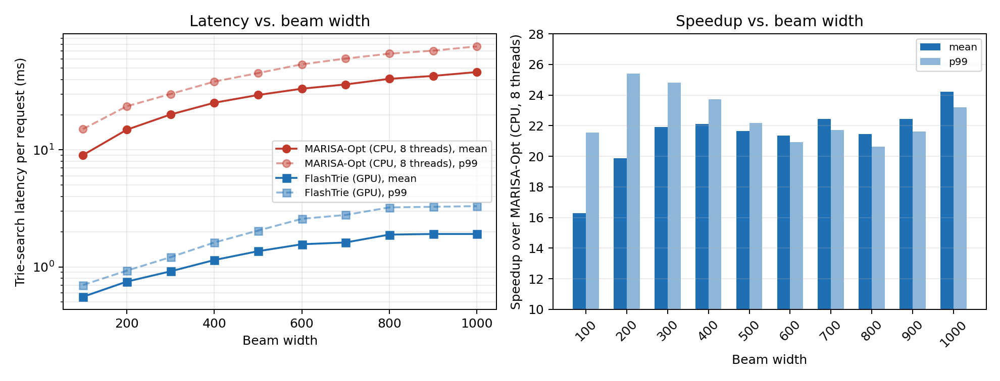
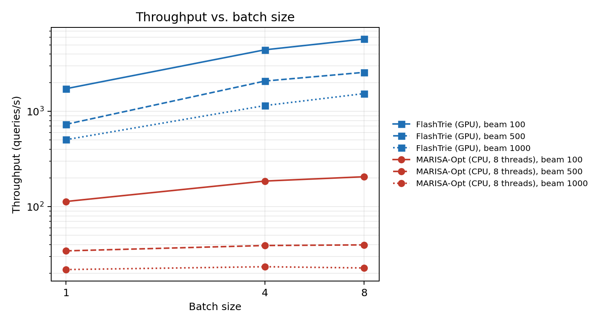

# FlashTrie

**GPU-accelerated constrained beam search for generative retrieval.**

FlashTrie keeps a billion-scale constraint trie resident in GPU memory and runs
the entire constrained beam search — expansion, validation, and pruning — inside
a single cooperative CUDA kernel, with no per-step round trip to the host.

On an 800M-keyword constraint library with beam widths up to 1000, FlashTrie
reduces trie-search latency to **under 2 ms**, a **16–24× speedup** over a
highly optimized multi-threaded CPU baseline, while producing the same results.

**Paper:** [FlashTrie: A GPU-Accelerated Constrained Beam Search for Generative
Retrieval](https://arxiv.org/abs/2607.10044) (EMNLP 2026, arXiv:2607.10044)



> *Per-request trie-search latency and speedup vs. beam width, 800M-key trie,
> 2.2M-token vocabulary, batch size 1, NVIDIA A100 80 GB.*

---

## Why constrained decoding is the bottleneck

In generative retrieval, a model emits an identifier that must exactly match an
entry in a predefined library. A trie constrains decoding so that only valid
prefixes survive at each step. That constraint is not optional: without it,
decoded candidates are overwhelmingly invalid, and the invalid rate rises with
identifier length.

The trie is also where the time goes. Most implementations run it on the CPU,
where limited parallelism makes traversal and candidate validation the serving
bottleneck exactly as beam width — and therefore retrieval quality — grows.
FlashTrie removes that bottleneck.

## Key results

Measured on 13,000 production retrieval requests, 800M-key constraint trie,
2.2M-token vocabulary, NVIDIA A100 80 GB with an AMD EPYC 7V13 host.

### Latency

Per-request trie-search latency at batch size 1.

| Beam width | MARISA-Opt (CPU, 8 threads) | FlashTrie | Speedup |
| --- | --- | --- | --- |
| **Mean** | | | |
| 100 | 9.03 ms | **0.56 ms** | 16.3× |
| 500 | 29.47 ms | **1.36 ms** | 21.6× |
| 1000 | 46.30 ms | **1.91 ms** | 24.2× |
| **p99** | | | |
| 100 | 15.08 ms | **0.70 ms** | 21.5× |
| 500 | 45.36 ms | **2.04 ms** | 22.2× |
| 1000 | 76.71 ms | **3.31 ms** | 23.2× |

### Throughput

Peak throughput over batch sizes 1–8, with the batch size that achieved it.

| Beam width | MARISA-Opt (CPU, 8 threads) | FlashTrie | Speedup |
| --- | --- | --- | --- |
| 100 | 206 q/s (batch 8) | **5,754 q/s** (batch 8) | 27.9× |
| 500 | 40 q/s (batch 8) | **2,571 q/s** (batch 8) | 64.8× |
| 1000 | 23 q/s (batch 4) | **1,539 q/s** (batch 8) | 65.8× |



The CPU baseline is already saturated at batch size 1 — batching buys it almost
nothing, because every additional request competes for the same eight threads.
FlashTrie scales with batch size instead.

### Index

| | MARISA-Opt | FlashTrie | |
| --- | --- | --- | --- |
| Index size, 800M keys | 4 GB | **3.1 GB** | 1.3× smaller |
| Build time, 800M keys | 2,718 s | **804 s** | 3.4× faster |

### Retrieval quality

Retrieval quality is unchanged: FlashTrie matches the CPU baseline to within
0.001 precision at every beam width. What changes is which beam widths are
affordable — Precision@100 rises from 0.53 to 0.78 as beam width goes from 100
to 1000, a regime the CPU baseline cannot serve within an online latency
budget. In a production A/B test on a commercial sponsored-search engine, the
resulting wider beam delivered a statistically significant **+0.71% revenue
lift**.

### Succinctness is what makes it deployable

A GPU-resident hash set over trie transitions is the natural "just move it to
the GPU" baseline. Under an identical kernel, thresholds, and beam management,
it is **3.1–4.0× slower on mean latency and 4.8–5.1× slower at p99**, because
each probe is a modulo followed by a pointer chase into 32-byte entries
scattered across a multi-gigabyte pool.

The memory gap is more decisive still: materializing every transition costs
**≈31 GB against 3.1 GB** for FlashTrie's Narrow-LOUDS layout. The hash index
does not fit the 10 GB A100 MIG slice that serves the production deployment;
FlashTrie does.

## Installation

### Requirements

- CUDA-capable NVIDIA GPU (developed and tested on A100 80 GB)
- CUDA Toolkit with `nvcc`
- CMake ≥ 3.14
- A C++17 compiler
- Python 3.8+ with `pybind11` and `numpy`, for the Python API and examples

### Build

```bash
git clone https://github.com/Dakshitha-BA/flash-trie.git
cd flash-trie
cmake -B build -DCMAKE_BUILD_TYPE=Release
cmake --build build -j
```

This produces the `flashtrie` Python extension in `build/tools/` alongside the
command-line tools.

By default the build targets compute capability 8.0 (Ampere). Override it for
your GPU:

```bash
cmake -B build -DCMAKE_CUDA_ARCHITECTURES=90   # Hopper
```

To record a per-phase GPU timing breakdown (expansion, validation, pruning,
grid sync), configure with `-DTBS_PROFILE=ON`. Leave it off for benchmarking.

If you build on a machine without a GPU, set `MARISA_MANAGED_ALLOC=0` to avoid
managed-memory allocations during trie construction.

## Quick start

```python
import sys
sys.path.insert(0, "build/tools")
import flashtrie

# Build a constraint library from tokenized identifiers.
trie = flashtrie.Trie()
trie.build([[10, 25, 3], [10, 25, 91], [7, 40]])
trie.save("trie.bin")

print(trie.num_keys(), trie.total_size())

# Allocate GPU workspace once, then reuse it across requests.
trie.init_tbs_gpu(max_batch_size=1)

# Per decoding step, supply the model's top-K token proposals and
# log-probabilities. Rows must be sorted by token id.
sequences, scores, lengths = flashtrie.bs_tbs_gpu(
    trie, batch_size, beams, topk_id, topk_logp,
    token_logp_threshold=-10.0,
    sents_logp_threshold=-40.0,
    length_norm=5.0,
    early_exit=False,
)
```

`flashtrie.tbs(...)` runs the same search for a single request and takes a
`use_gpu` flag, so it doubles as the CPU reference path.

## Examples and benchmarks

[`examples/`](examples/) contains runnable benchmarks that reproduce the
paper's measurements, plus a generator so everything runs without proprietary
data:

```bash
cd examples

# Synthetic constraint library and per-beam-width proposal files.
python make_example_data.py --per-topk-files 100,600,1000

# Beam-width sweep.
python run_trie_search_BWsweep.py \
    --trie-path data/trie.bin \
    --data-path 'data/topk/output_topk*.tsv' \
    --file-values 100 600 1000 --onemap \
    --output-dir out/bw

# Batch-size sweep.
python run_trie_search_BSsweep.py \
    --trie-path data/trie.bin \
    --data-path data/topk \
    --topk-values 100,600,1000 \
    --batch-sizes 1,2,4,8,16,32 \
    --output-dir out/bs
```

Pin the process to one NUMA node when measuring latency, as we did for every
number in the paper:

```bash
numactl --cpunodebind=0 --membind=0 taskset -c 0-7 python run_trie_search.py ...
```

See the [examples README](examples/README.md) for the input format, the full
flag reference, and how to check that the GPU and CPU paths return the same
candidate set.

## Command-line tools

Build a constraint trie from a file of space-separated token ids, one
identifier per line:

```bash
./build/tools/marisa-build -n 1 -l keys.txt -o trie.bin
```

`-n 1` is required: GPU beam search supports `num_tries = 1`.

Run constrained beam search directly:

```bash
./build/tools/marisa-beam-search [-e] DATASET_DIR [BEAM_WIDTH] [BATCH_SIZE]
```

`DATASET_DIR` must contain `marisa_trie.bin`, `topk_keys.txt`, and
`topk_scores.txt`. The two text files share a layout: a first line of
`num_requests max_output_len topk`, then `num_requests * max_output_len` lines
of exactly `topk` space-separated values, in matching order. Pass `-e` to
enable early exit.

## How it works

FlashTrie extends the [MARISA](https://github.com/s-yata/marisa-trie) static
succinct trie and rebuilds constrained beam search around GPU execution.

**Narrow-LOUDS: an integer-aware succinct layout.** MARISA stores tries over
character-level keys. Generative retrieval needs integer tokens from vocabularies
of millions. FlashTrie splits each 32-bit label and narrows link offsets, storing
the trie as bit arrays rather than nodes and pointers. The 800M-key index fits in
3.1 GB, so the whole constraint structure stays in GPU high-bandwidth memory and
traversal reads are contiguous and coalesced.

**A cooperative kernel.** One persistent CUDA kernel runs every decoding step to
completion, synchronizing across steps with a grid-wide barrier instead of
returning to the CPU. The host pays the launch cost once per query rather than
once per step, which is what keeps latency in a narrow band as beam width grows.

**Two-level parallelism.** All beams expand simultaneously, and within each beam
all top-K candidate tokens are checked simultaneously. This hierarchy saturates
hundreds of streaming multiprocessors and keeps occupancy high.

**GPU-aware node primitives.** Pointer chasing and heap maintenance are replaced
by parallel binary child search and heap-free top-B selection. Node-level lookup
design matters as much as layout: holding the layout fixed and substituting a
linear scan for binary child search costs **71×–209×**.

## Scope

The constraint mechanism is domain-agnostic by construction. FlashTrie indexes
any set of tokenized integer sequences that can be enumerated offline, and its
runtime interface is a child-lookup against a prefix state plus a top-K proposal
array — neither the layout nor the kernel inspects what a key means.

Evaluation covers a production sponsored-search workload and a public
NQ-Open + GENRE-KILT setup over a ~6M-title Wikipedia trie, which reproduces the
same qualitative speedup on a different model and constraint set. Retrieval-ID
and product-catalog settings are architectural extensions we have not yet
evaluated empirically.

## Citation

```bibtex
@inproceedings{anandakumar2026flashtrie,
  title     = {FlashTrie: A GPU-Accelerated Constrained Beam Search for
               Generative Retrieval},
  author    = {Anandakumar, Dakshitha and Mukkara, Anurag and Hu, Wenxiang and
               Kumar, M Akash and Chen, Jiusheng and Ye, Ting and Lou, Qiang and
               Jiao, Jian},
  booktitle = {Proceedings of the 2026 Conference on Empirical Methods in
               Natural Language Processing (EMNLP)},
  year      = {2026},
  eprint    = {2607.10044},
  archivePrefix = {arXiv},
  primaryClass  = {cs.IR},
  url       = {https://arxiv.org/abs/2607.10044}
}
```

## License

FlashTrie extensions are released under the MIT License.
Copyright (c) 2026 Microsoft Corporation.

This repository builds on [marisa-trie](https://github.com/s-yata/marisa-trie)
by Susumu Yata, licensed under BSD-2-Clause OR LGPL-2.1-or-later. See
[`COPYING.md`](COPYING.md) for full details.
